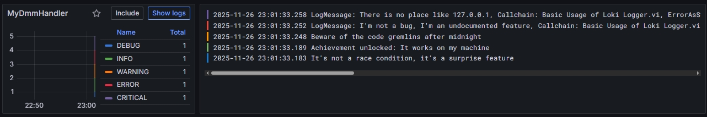

# LokiLoggerHandler for LabVIEW

This README explains how to run the included Loki + Grafana stack and how to use the **LokiLoggerHandler** in LabVIEW to send structured JSON logs to a local Loki instance.

---

## 1. Prerequisites

To run the local Loki stack, you need **one** of the following:

- **Docker Desktop** (Windows / macOS / Linux)
- **Podman** (Linux, Windows with podman-machine)

Either tool works—this project only requires the ability to run Docker Compose files.

---

## 2. Download the Loki Stack

In this repository, below this `README.md` in the `docs`-folder, you will find a file:

```
docker-compose.yml
```

Download or clone this repository so that both files sit in the same folder.

---

## 3. Starting the Loki + Grafana Stack

1. Open **PowerShell**.
2. Navigate into the folder containing `docker-compose.yml`.

Example:

```powershell
cd "C:\path\to\your\folder"
```

3. Start the stack:

```powershell
docker compose -f docker-compose.yml up -d
```

This launches:

- **Loki** (listening on `http://localhost:3100`)
- **Grafana** (available at `http://localhost:3000`)
- **Promtail** (optional: scrapes local /var/log — mostly irrelevant for Windows)

The LokiLoggerHandler was **developed and tested exclusively against this setup**.

There is **no authentication**, and Loki exposes the push endpoint:

```
http://localhost:3100/loki/api/v1/push
```

This  logger sends logs directly to this URL.

---

## 4. Using the Logger in LabVIEW

The basic usage of the Loki logger can be found in the examples and works out of the box if you followed this instruction. 


---


## 5. Viewing the Logs

After starting the stack, open:

```
http://localhost:3000
```

Grafana will present a preconfigured Loki datasource.\
To view logs:

1. Open **Explore**
2. Choose the **LOGS** on the left
3. This should give you already an overview of the logs and will look like this:

4. For filtering, enter a query such as:

```
{application="LabVIEW", service="MyModule"}
```

4. Press **Run Query**

Your LabVIEW log messages should now appear.

## 6. How Loki Expects Log Data
**The next part is completely irrelevant for daily use, because the package takes care about all formatting. **
Logs are sent via HTTP POST to:

```
http://localhost:3100/loki/api/v1/push
```

using a JSON body of the form:

```json
{
  "streams": [
    {
      "stream": {
        "application": "LabVIEW",
        "service": "MyModule",
        "key": "Value"
      },
      "values": [
        ["1732457436123456789", "Power supply initialized"]
      ]
    }
  ]
}
```

### 6.1 Meaning of the fields

#### ``

A list of log streams to push in one request. Each stream groups logs that share the same label set.

#### `` (labels)

A set of **labels**, i.e., key/value pairs that define *which stream the log entry belongs to*.

Example:

```json
"stream": {
  "application": "LabVIEW",
  "service": "MyModule",
  "key": "Value"
}
```

Each of these fields becomes a **Loki label**, used for filtering in Grafana:

- `level` – the log level of the entry - is always present for each log entry`and will be added automatically
- `application` – typically identifies the technology or runtime (e.g., "LabVIEW").
- `service` – identifies the logical module emitting logs.
- `key` / additional labels – arbitrary metadata you choose. Useful for filtering and grouping test runs.

Labels allow queries such as:

```
{application="LabVIEW", service="MyModule"}
```

#### ``

A list of individual log entries. Each entry is:

```
[timestamp_ns, message_string]
```

Example:

```json
["1732457436123456789", "Power supply initialized"]
```

- **timestamp** – required, must be a Unix timestamp in **nanoseconds**, encoded as a string.
- **message** – the actual log text.

Multiple log lines can be batched:

```json
"values": [
  ["1732457436123456789", "Step A started"],
  ["1732457436123460000", "Step A finished"]
]
```


---

## 7. Summary

- Install Docker or Podman
- Run `docker compose up -d` in the folder containing the provided docker-compose.yml
- Loki is available at: `http://localhost:3100/loki/api/v1/push`
- Send logs using Loki’s JSON push format
- Labels inside the `stream` object control how logs are grouped and filtered
- View logs in Grafana at `http://localhost:3000`

If you need help with a LabVIEW example VI for pushing logs or timestamp handling, let me know.

